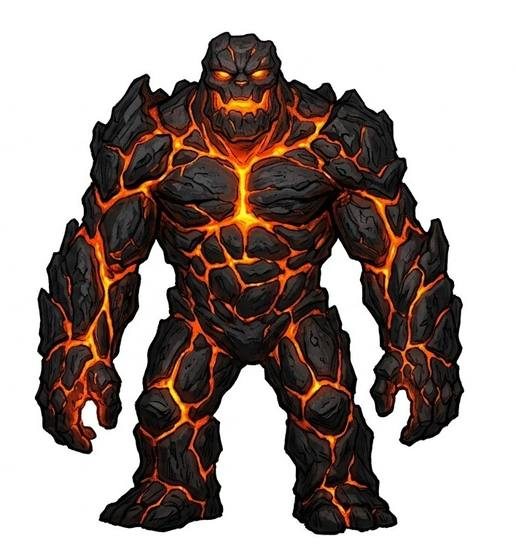

# Magma elemental

{.illus}

*Set: Expansion*

*aka: ______________________________*

*[Elemental-kind](../Species_Families/elemental-kind.md) · large biped · slow · fantasy, myth*

A slow, glowing mass of molten rock wrapped in a crust of cooling black stone that splits and heals as it moves. Heat rolls off it in waves. It leaves burning footprints behind it, and wood, cloth and grass burst into flame at its touch.

It is mindless and never flees. It is drawn up from deep places by volcanoes, rituals or summoners, and it wanders slowly, burning everything it meets. Weapons that strike it glow and soften. Water turns to steam against it, but a great deal of cold water cools its crust until it cracks and stills. Most people simply stay out of its path and let it wander back to the fire.

## Stat block

- **Attack** 21 · **Parry** — · **Dodge** 3 · **Armour** 3 · **Life** 36 · **Threat** 2
- **Attacks:** slam 1d6+2
- **Attributes:** STR 24 DEX 7 AGI 7 END 28 INT 2 WIS 7 PER 7 CHA 2 COU 20
- **Skills:** [Brawling](../Weapon_Groups/brawling.md) +4
- **Powers:** [Magma & Plasma](../Powers/magma-and-plasma.md) 3, [Elemental Aura](../Powers/elemental-aura.md) 2, [Resist Element](../Powers/resist-element.md) 4
- **Behaviour:** leaves burning footprints; sets wood and cloth alight. **Morale:** mindless, never flees.

How to read this block: [Bestiary](../bestiary.md).

## Not to be confused with

The *[Magma ooze](magma-ooze.md)*, a shapeless flow of slag from vents; the magma elemental walks on two legs as a spirit of molten rock.

