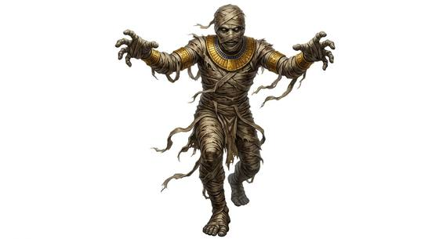

# Mummified guardian

{.illus}

*Set: Core*

*aka: ______________________________*

*[Undead and deathless](../Species_Families/undead-and-deathless.md) · medium biped · slow · fantasy, horror, historical, myth*

A servant buried with its master and wrapped in linen bandages, stained brown with resin and age. It stands in sealed tombs, motionless, until someone disturbs the dead.

Then it pursues the intruder without rest, through corridors, across deserts and into towns, until it catches them. It has no mind and never flees. It is slow, but it does not stop. Fire is the best weapon, as the resin in its wrappings burns fiercely. Some say the only real defence is to return what was stolen.

## Stat block

- **Attack** 18 · **Parry** — · **Dodge** 5 · **Armour** 2 · **Life** 24 · **Threat** minor+
- **Attacks:** slam 1d6+1
- **Attributes:** STR 16 DEX 8 AGI 8 END 21 INT 2 WIS 8 PER 11 CHA 1 COU 20
- **Powers:** [Disease](../Powers/disease.md) 3, [Fear](../Powers/fear.md) 2
- **Behaviour:** stands in sealed tombs; pursues thieves without rest. **Morale:** mindless, never flees.
- **Kin:** cursed disease-touch mummy

How to read this block: [Bestiary](../bestiary.md).

## Not to be confused with

the *[mummified sacred beast](mummified-sacred-beast.md)*, a wrapped temple animal; the guardian is a wrapped servant that pursues tomb robbers.

