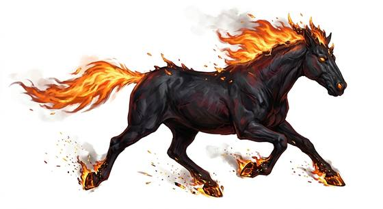

# Nightmare horse

{.illus}

*Set: Core*

*aka: ______________________________*

*[Planar](../Species_Families/planar.md) · large quadruped · fast runner · fantasy, horror, myth*

A black horse with a mane of fire, burning hooves and eyes like coals. It can run across the air as easily as the ground, galloping through sky and smoke, leaving a trail of sparks behind it.

It carries dark riders on their errands, and those who see it passing overhead at night say it is an omen of evil. It flees when badly hurt, but it is fast and strong, and hard to catch.

## Stat block

- **Attack** 20 · **Parry** — · **Dodge** 9 · **Armour** 2 · **Life** 26 · **Threat** 2+
- **Attacks:** hooves 1d6+2; bite 1d6+2
- **Attributes:** STR 19 DEX 13 AGI 13 END 16 INT 5 WIS 11 PER 11 CHA 4 COU 17
- **Skills:** [Running](../Skills/running.md) +5 (reroll 1), [Intimidation](../Skills/intimidation.md) +4
- **Powers:** [Flight](../Powers/flight.md) 2, [Fire Walking](../Powers/fire-walking.md) 3, [Fear](../Powers/fear.md) 2
- **Behaviour:** gallops through sky and smoke; carries dark riders. **Morale:** flees when badly hurt.

How to read this block: [Bestiary](../bestiary.md).

## Not to be confused with

the *[flame-hooved steed](flame-hooved-steed.md)*, another fiery horse; the nightmare horse is a spirit that gallops through the air.

