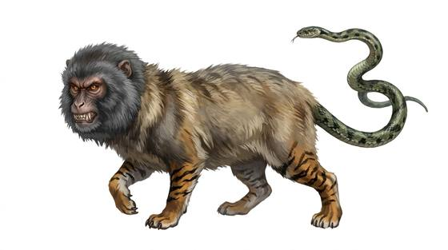

# Nue

{.illus}

*Set: Core*

*aka: ______________________________*

*[Hybrid and chimeric](../Species_Families/hybrid-and-chimeric.md) · large quadruped · climber · fantasy, myth, horror*

A beast of nightmares: a monkey's face, a tanuki's body, a tiger's limbs and a snake for a tail. It arrives in black clouds of smoke with an eerie, piping cry, and it sits on the roofs of palaces at night.

Its presence brings sickness to lords and fear to all who hear it. It fights with claws and fangs, but flees when badly hurt. A famous archer once shot one down from a palace roof. Since then, palace guards keep bows ready on dark nights.

## Stat block

- **Attack** 20 · **Parry** — · **Dodge** 11 · **Armour** 2 · **Life** 26 · **Threat** 3+
- **Attacks (2 a round):** claws 1d6+2; fangs 1d6+2
- **Attributes:** STR 17 DEX 15 AGI 15 END 16 INT 5 WIS 12 PER 12 CHA 3 COU 15
- **Skills:** [Stealth](../Skills/stealth.md) +5 (reroll 1), [Climbing](../Skills/climbing.md) +4
- **Powers:** [Fear](../Powers/fear.md) 2, [Curse](../Powers/curse.md) 2, [Fog & Mist](../Powers/fog-and-mist.md) 2
- **Behaviour:** sits on roofs in black clouds; sickens lords. **Morale:** flees when badly hurt.

How to read this block: [Bestiary](../bestiary.md).

## Not to be confused with

the *[Owl-headed Bear](owl-headed-bear.md)*, another beast made of mismatched animals, but one that attacks in open fury.

