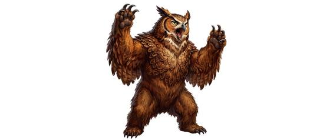

# Owl-headed bear

{.illus}

*Set: Expansion*

*aka: ______________________________*

*[Hybrid and chimeric](../Species_Families/hybrid-and-chimeric.md) · large quadruped · walk · fantasy, myth*

A furious hybrid with a bear's body and an owl's head, feathers blending into fur at the neck and shoulders. It has a bear's strength and an owl's hooked beak, and it is bad-tempered and nearly always hungry.

It attacks anything that comes near, hugging and crushing its prey with its heavy arms and tearing with its beak. It fights to the death. Travellers in deep forests listen for its hooting growl and back away slowly.

## Stat block

- **Attack** 21 · **Parry** — · **Dodge** 7 · **Armour** 2 · **Life** 31 · **Threat** 3
- **Attacks (2 a round):** smashing claws 2d6; beak 1d6+1
- **Attributes:** STR 21 DEX 11 AGI 11 END 19 INT 3 WIS 11 PER 15 CHA 3 COU 18
- **Skills:** [Wrestling & Grappling](../Weapon_Groups/wrestling-and-grappling.md) +5
- **Powers:** —
- **Behaviour:** attacks anything; hugs and crushes. **Morale:** fights to the death.

How to read this block: [Bestiary](../bestiary.md).

## Not to be confused with

the *[Brown Bear](brown-bear.md)*, an ordinary bear that is dangerous but does not have a beak.

