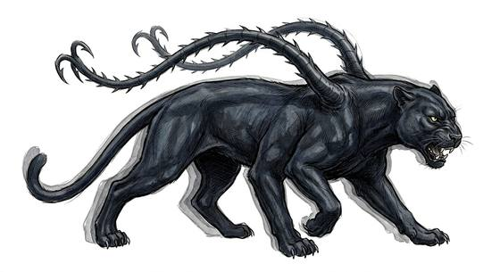

# Phase-shifting panther

{.illus}

*Set: Expansion*

*aka: ______________________________*

*[Feline](../Species_Families/feline.md) · large quadruped · fast runner · fantasy*

A sleek, black, six-legged panther the size of a small horse, with two long, barbed tentacles rising from its shoulders. Light bends around it, so it always seems to stand a pace from where it really is. Blows go through empty air, arrows miss by a hand's width, and the tentacles strike from a place no one is watching.

It hunts in prides, and is clever and cruel. It flees when badly hurt. Hunters who have fought one learn to aim to the side, and to trust sound over sight. Its hide is rare and highly prized, because the cloak made from it keeps something of the trick.

## Stat block

- **Attack** 21 · **Parry** — · **Dodge** 12 · **Armour** 1 · **Life** 25 · **Threat** 2
- **Attacks (2 a round):** tentacle lash 1d6+2; bite 1d6+2
- **Attributes:** STR 17 DEX 16 AGI 16 END 15 INT 4 WIS 13 PER 17 CHA 6 COU 15
- **Skills:** [Stealth](../Skills/stealth.md) +5 (reroll 1), [Tracking](../Skills/tracking.md) +5
- **Powers:** [Mirror Images](../Powers/mirror-images.md) 3, [Night & Spectrum Sight](../Powers/night-and-spectrum-sight.md) 2
- **Behaviour:** hunts in prides; always seems a step from where it is. **Morale:** flees when badly hurt.

How to read this block: [Bestiary](../bestiary.md).

## Not to be confused with

*[Phase-hunting spider](phase-hunting-spider.md)*, a spider that steps in and out of the world, where the panther stays put but only seems to be somewhere else.

