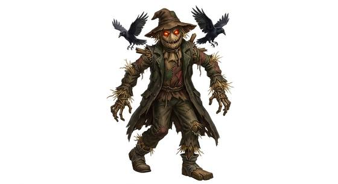

# Possessed scarecrow

{.illus}

*Set: Core*

*aka: ______________________________*

*[Energy and incorporeal](../Species_Families/energy-and-incorporeal.md) · medium biped · walk · horror, fantasy, modern, myth*

All summer it hangs on its post in the middle of the field: a sack face, a straw belly, an old coat buttoned wrong. Crows ignore it, and children dare each other to touch it. Then a restless spirit crawls inside, and at harvest time the post is empty in the morning.

The possessed scarecrow does not think. It stalks the rows at dusk, stops dead whenever it is seen, and moves again the moment eyes turn away. It kills with claw-like hands and leaves the bodies in the stubble. It never flees and never tires, and a blade through straw does little. Farmers burn it, or drive the spirit out and bury the empty coat at a crossroads. Few leave a scarecrow standing after that.

## Stat block

- **Attack** 17 · **Parry** — · **Dodge** 8 · **Armour** 0 · **Life** 16 · **Threat** minor+
- **Attacks:** claws 1d6+1
- **Attributes:** STR 13 DEX 11 AGI 11 END 12 INT 3 WIS 9 PER 9 CHA 2 COU 20
- **Skills:** [Stealth](../Skills/stealth.md) +5, [Camouflage](../Skills/camouflage.md) +4
- **Powers:** [Fear](../Powers/fear.md) 2
- **Behaviour:** waits motionless in the fields; stalks at harvest. **Morale:** mindless, never flees.

How to read this block: [Bestiary](../bestiary.md).

## Not to be confused with

The *[Animated scarecrow](animated-scarecrow.md)*, woken by a deliberate curse to guard crops; the possessed scarecrow is simply a vessel a wandering spirit has climbed into.

