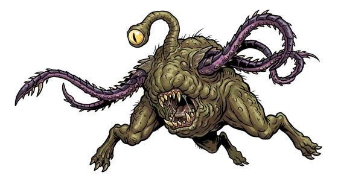

# Refuse-pit tentacle beast

{.illus}

*Set: Expansion*

*aka: ______________________________*

*[Trans-dimensional](../Species_Families/trans-dimensional.md) · large other · slow · fantasy, horror*

A lumpy, three-legged creature the size of a bull, living buried in dung heaps, middens and sewers with only an eye on a stalk showing above the filth. It has a wide, fanged mouth in the middle of its body and two long tentacles lined with spikes. When anything comes near, the tentacles lash out and drag it toward the mouth.

It eats rubbish, corpses and anything else, and its bite carries a wasting fever. It flees when badly hurt. Town rakers and sewer workers learn to watch for the eye, and never dig into a heap of refuse with bare hands.

## Stat block

- **Attack** 17 · **Parry** — · **Dodge** 2 · **Armour** 2 · **Life** 30 · **Threat** 2+
- **Attacks (2 a round):** spikes 1d6+2; tentacle lash 1d6+2; bite 1d6+2
- **Attributes:** STR 18 DEX 6 AGI 6 END 18 INT 6 WIS 12 PER 16 CHA 3 COU 15
- **Skills:**, [Stealth](../Skills/stealth.md) +3
- **Powers:** [Disease](../Powers/disease.md) 3, [Poison & Disease Immunity](../Powers/poison-and-disease-immunity.md) 3
- **Behaviour:** lurks in dung heaps; grabs anything that comes near. **Morale:** flees when badly hurt.

How to read this block: [Bestiary](../bestiary.md).

## Not to be confused with

*[Sewer tentacle lurker](sewer-tentacle-lurker.md)*, another filth-dweller that grabs from below, where the refuse-pit beast is a three-legged lump with a fanged mouth and fever bite.

