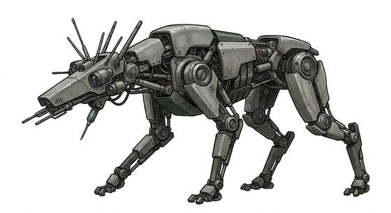

# Robot hound

{.illus}

*Set: Expansion*

*aka: ______________________________*

*[Constructs and synthetics](../Species_Families/constructs-and-synthetics.md) · medium quadruped · fast runner · sci-fi, post-apocalyptic*

A four-legged robot of servos and armour plate, the size of a large dog, with a sensor head in place of a face. It moves with a disturbing smooth lope, silent except for a soft whir. It sees in the dark and hears heartbeats.

It runs in packs, spreading out to herd a fugitive and then pinning them down so its handlers can arrive. It is mindless and never flees. Bullets glance off its plates. The hounds are used by security forces and occupying armies, and the sight of one on a street corner makes a whole neighbourhood go quiet. Some hackers can turn them; everyone else runs.

## Stat block

- **Attack** 20 · **Parry** — · **Dodge** 12 · **Armour** 3 · **Life** 18 · **Threat** 2
- **Attacks:** bite 1d6+1
- **Attributes:** STR 14 DEX 15 AGI 15 END 14 INT 3 WIS 12 PER 12 CHA 1 COU 20
- **Skills:** [Tracking](../Skills/tracking.md) +5 (reroll 1), [Running](../Skills/running.md) +4
- **Powers:** [Night & Spectrum Sight](../Powers/night-and-spectrum-sight.md) 3
- **Behaviour:** runs in packs; pins targets for handlers. **Morale:** mindless, never flees.

How to read this block: [Bestiary](../bestiary.md).

## Not to be confused with

The *[Clockwork hound](clockwork-hound.md)*, an older machine of springs and gears that hunts alone by scent; the robot hound hunts in packs with modern sensors.

