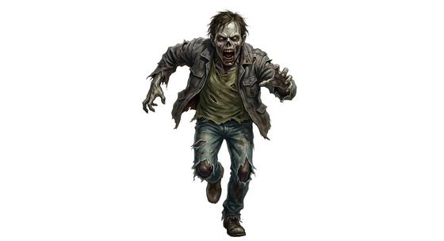

# Running zombie

{.illus}

*Set: Core*

*aka: ______________________________*

*[Undead and deathless](../Species_Families/undead-and-deathless.md) · medium biped · fast runner · horror, modern, post-apocalyptic, fantasy*

A freshly turned corpse that has not yet begun to stiffen or rot. It runs flat out, arms flailing and mouth open, and it never slows down or tires. It still wears the clothes it died in, and sometimes a face its friends would recognise.

Running zombies sprint at any noise, a shout, a slammed door, a gunshot, and they hunt in shrieking crowds that pour through streets like floodwater. They have no minds and never flee. The survivors who last are the ones who learn to move quietly, block the stairs and never, ever run out into the open.

## Stat block

- **Attack** 18 · **Parry** — · **Dodge** 10 · **Armour** 0 · **Life** 16 · **Threat** minor+
- **Attacks:** bite 1d6+1; claws 1d6+1
- **Attributes:** STR 12 DEX 13 AGI 13 END 12 INT 1 WIS 6 PER 9 CHA 1 COU 20
- **Skills:** [Running](../Skills/running.md) +5
- **Powers:** [Disease](../Powers/disease.md) 2
- **Behaviour:** sprints at noise; hunts in shrieking crowds. **Morale:** mindless, never flees.
- **Kin:** hunger-plague infected zombie

How to read this block: [Bestiary](../bestiary.md).

## Not to be confused with

the *[shrieking zombie](shrieking-zombie.md)*, which calls the horde with its howl; the running zombie is the horde, sprinting at every sound.

