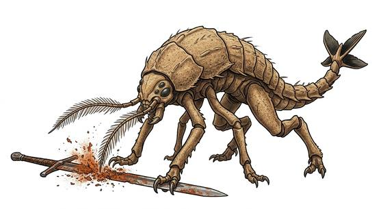

# Rust-eating beast

{.illus}

*Set: Expansion*

*aka: ______________________________*

*[Insectoid and arachnid](../Species_Families/insectoid-and-arachnid.md) · medium quadruped · walk · fantasy*

A bug-like animal about the size of a pony, with four legs, a hard hide, a tail that ends in a small propeller-like fin, and two long, feathery feelers on its head. It smells metal from far off. When its feelers touch iron or steel, the metal crumbles into flakes of rust, and the beast gobbles them up.

It isn't really dangerous to flesh. It's dangerous to swords, armour, coins, hinges and nails, which for most adventurers is worse. It flees when badly hurt. Smiths hate it, and wise warriors facing one fight with wood, stone and bare hands.

## Stat block

- **Attack** 14 · **Parry** — · **Dodge** 11 · **Armour** 2 · **Life** 17 · **Threat** 1+
- **Attacks:** claws 1d6+1
- **Attributes:** STR 12 DEX 14 AGI 14 END 13 INT 2 WIS 12 PER 16 CHA 4 COU 11
- **Skills:** [Tracking](../Skills/tracking.md) +5 (reroll 1)
- **Powers:** [Acid & Corrosion](../Powers/acid-and-corrosion.md) 3, [Enhanced Senses](../Powers/enhanced-senses.md) 2
- **Behaviour:** smells metal; its feelers turn iron to rust it eats. **Morale:** flees when badly hurt.

How to read this block: [Bestiary](../bestiary.md).

## Not to be confused with

*[Iron-eating beast](iron-eating-beast.md)*, another metal-eater, which eats iron by chewing it, where the rust-eating beast turns metal to rust with a touch.

