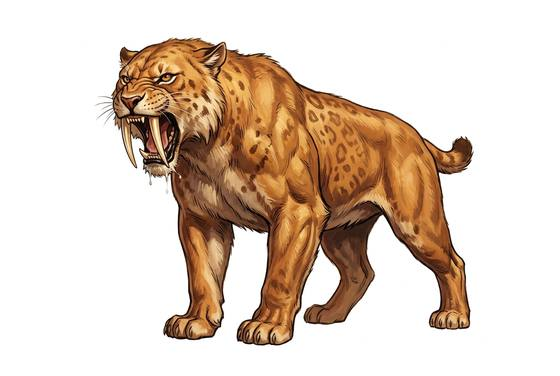

# Sabre-toothed cat

{.illus}

*Set: Core*

*aka: ______________________________*

*[Feline](../Species_Families/feline.md) · large quadruped · walk · prehistoric, fantasy, historical*

A heavily built ice-age cat, larger than a lion, with short powerful legs, a stubby tail and two upper fangs like curved daggers. It is not a runner. It waits in ambush among rocks, reeds or forest shadows, bursts out, pins large prey with its great forelimbs and drives its fangs into the throat.

Its prey is big: bison, horses, young mammoths. People are rarely its first choice, but they are not safe either. Stone-age tribes tell stories of it as a spirit of sudden death. It flees when badly hurt, since those fangs are fragile and it cannot hunt with them broken.

## Stat block

- **Attack** 20 · **Parry** — · **Dodge** 10 · **Armour** 1 · **Life** 23 · **Threat** 2
- **Attacks (2 a round):** great bite 2d6; claws 1d6+2
- **Attributes:** STR 18 DEX 14 AGI 14 END 15 INT 3 WIS 12 PER 12 CHA 4 COU 15
- **Skills:** [Stealth](../Skills/stealth.md) +5, [Hunting](../Skills/hunting.md) +5
- **Powers:** —
- **Behaviour:** ambushes large prey; pins it and bites the throat. **Morale:** flees when badly hurt.

How to read this block: [Bestiary](../bestiary.md).

## Not to be confused with

the *[cave lion](cave-lion.md)*, a fast pride hunter of the cold steppe; the sabre-toothed cat is heavier, slower and ambushes alone.

