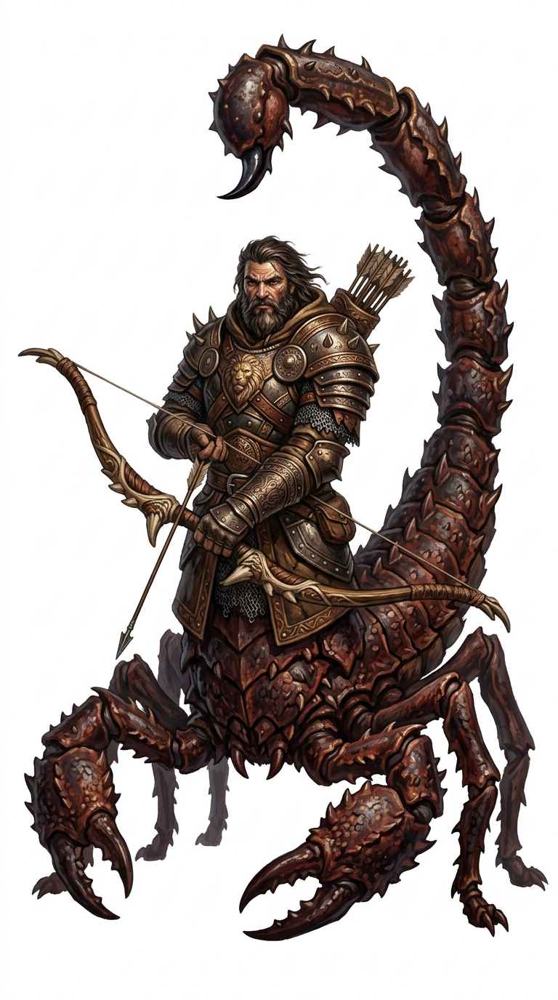

# Scorpion-tailed guardian

{.illus}

*Set: Expansion*

*aka: ______________________________*

*[Hybrid and chimeric](../Species_Families/hybrid-and-chimeric.md) · large biped · walk · sentient · fantasy, myth*

A towering guardian with the upper body of a bearded man, broad and muscled, set on the legs and armoured tail of a giant scorpion. Its pincers could snap a spear shaft. It stands in pairs at the gates of the mountains where the sun rises, and nothing passes without answering its questions.

Its gaze fills travellers with terror, and its sting carries a burning venom. It is not mindless: it listens, weighs answers and sometimes lets the worthy through. Those who try to force their way past face a guardian that fights to the death and does not leave its post.

## Stat block

- **Attack** 21 · **Parry** 18 · **Dodge** 8 · **Armour** 2 · **Life** 30 · **Threat** 5+
- **Attacks (2 a round):** pincers 1d6+2; stinger 1d6+2
- **Attributes:** STR 19 DEX 12 AGI 12 END 18 INT 11 WIS 14 PER 19 CHA 8 COU 17
- **Skills:** (reroll 1), [Riddling](../Skills/riddling.md) +4
- **Powers:** [Poison Touch](../Powers/poison-touch.md) 3, [Fear](../Powers/fear.md) 2
- **Behaviour:** guards the gates of sunrise; questions travellers. **Morale:** fights to the death.

How to read this block: [Bestiary](../bestiary.md).

## Not to be confused with

the *[Guardian Lion](guardian-lion.md)*, a gate guardian that watches silently in pairs and never asks questions.

