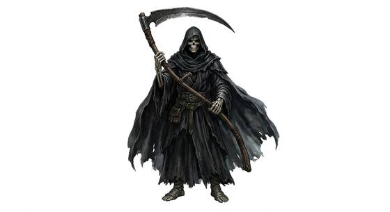

# Scythed reaper

{.illus}

*Set: Core*

*aka: ______________________________*

*[Energy and incorporeal](../Species_Families/energy-and-incorporeal.md) · medium biped · hover · sentient · fantasy, horror, myth*

A tall shape in a hooded cloak, and inside the hood nothing but bone. It carries a great scythe and drifts a hand's breadth above the floor, making no sound on stairs or gravel. It is not a hunter in the ordinary sense. It comes for one soul that has stayed too long in the world: a man who cheated his hour, a sorceress who bargained for more years, a sick child someone refused to let go.

Anyone standing between the reaper and its mark is simply cut down, like wheat in the way of the blade. Walls do not stop it, and it does not tire or turn back. Wise folk step aside. The brave or foolish try to hide the marked one, argue, or bargain, and most learn that the reaper keeps no ledger but its own.

## Stat block

- **Attack** 20 (rerolls 1) · **Parry** 17 · **Dodge** 11 · **Armour** 1 · **Life** 22 · **Threat** 2
- **Attacks:** blade arms 1d6+1
- **Attributes:** STR 12 DEX 14 AGI 14 END 14 INT 12 WIS 16 PER 16 CHA 6 COU 20
- **Skills:** [Great Weapons](../Weapon_Groups/great-weapons.md) +5 (reroll 1), [Stealth](../Skills/stealth.md) +5
- **Powers:** [Death Touch](../Powers/death-touch.md) 3, [Etherealness](../Powers/etherealness.md) 3, [Death-Sensing](../Powers/death-sensing.md) 4
- **Behaviour:** comes only for those marked; cuts through all else. **Morale:** fights to the death.

How to read this block: [Bestiary](../bestiary.md).

## Not to be confused with

The *[Wraith](wraith.md)*, a hungry dead thing that preys on any living soul it finds; the reaper comes for one appointed victim and cares for nothing else.

