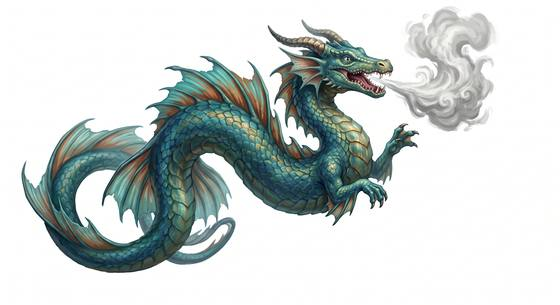

# Sea dragon

{.illus}

*Set: Expansion*

*aka: ______________________________*

*[Draconic](../Species_Families/draconic.md) · huge serpentine · swimmer · fantasy, myth*

A great wingless dragon of warm seas, with fins in place of legs and a long, finned tail that drives it through the water faster than a galley under full oar. Its scales are the green-blue of shallow water over sand, and when it surfaces it breathes out a hissing cloud of steam.

It patrols reefs and narrow straits as its own. Boats that stray into its waters are rammed from below or rolled over by the swell it raises with its body. Fishing towns leave offerings on the rocks and send their boats out only in the right season. Badly hurt, a sea dragon sinks away and sulks in the deep.

## Stat block

- **Attack** 23 (rerolls 1) · **Parry** — · **Dodge** 8 · **Armour** 3 · **Life** 48 · **Threat** 6
- **Attacks (2 a round):** great bite 2d6+1; claws 2d6; tail 2d6
- **Attributes:** STR 26 DEX 13 AGI 13 END 24 INT 5 WIS 13 PER 18 CHA 8 COU 17
- **Skills:** [Swimming](../Skills/swimming.md) +5 (reroll 2), [Diving](../Skills/diving.md) +5 (reroll 1)
- **Powers:** [Water Breathing](../Powers/water-breathing.md) 3, [Water Control](../Powers/water-control.md) 2, [Toughness](../Powers/toughness.md) 2
- **Behaviour:** patrols reefs and straits; rams and capsizes boats. **Morale:** flees when badly hurt.

How to read this block: [Bestiary](../bestiary.md).

## Not to be confused with

the *[dragon turtle](dragon-turtle.md)*, a shelled giant of the sea; the sea dragon is sleeker, swifter and has no shell.

