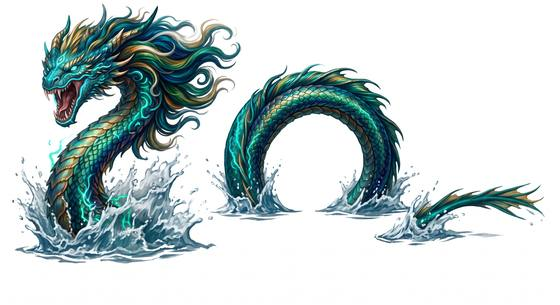

# Sea serpent

{.illus}

*Set: Expansion*

*aka: ______________________________*

*[Serpentine](../Species_Families/serpentine.md) · huge serpentine · swimmer · fantasy, myth, historical*

A long, sinuous serpent of the open ocean, with a horse-like head, a mane of fleshy fronds along its neck and coils that rise from the water in a row of humps. Sailors in every age and every sea have sighted one, and most of them were telling the truth.

It hunts small ships. It wraps a coil around the hull, rears its head over the deck and plucks sailors off one at a time. Larger vessels it tends to follow at a distance, as if curious. A few good wounds usually drive it off, and it sinks away with an angry hiss. Fishermen paint eyes on their bows to stare it down.

## Stat block

- **Attack** 22 · **Parry** — · **Dodge** 8 · **Armour** 2 · **Life** 42 · **Threat** 4
- **Attacks (2 a round):** great bite 2d6+1; constrict 2d6
- **Attributes:** STR 24 DEX 13 AGI 13 END 22 INT 3 WIS 11 PER 15 CHA 5 COU 16
- **Skills:** [Swimming](../Skills/swimming.md) +5 (reroll 2), [Stealth](../Skills/stealth.md) +4
- **Powers:** [Water Breathing](../Powers/water-breathing.md) 4, [Toughness](../Powers/toughness.md) 1
- **Behaviour:** coils around small ships; plucks sailors from decks. **Morale:** flees when badly hurt.

How to read this block: [Bestiary](../bestiary.md).

## Not to be confused with

the *[great sea serpent](great-sea-serpent.md)*, a vastly larger kind that crushes galleons; the ordinary sea serpent picks off crews from small boats.

