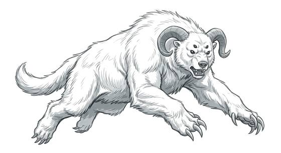

# Shaggy snow predator

{.illus}

*Set: Expansion*

*aka: ______________________________*

*[Simian](../Species_Families/simian.md) · large biped · walk · sci-fi*

A great white-furred beast of the ice worlds, standing on two legs, with curling horns, a heavy jaw and forearms that end in claws like picks. Its coat is so pale against the snowfield that a hunter can be watching the ground where it lies and not see it until it stands up.

It ambushes. A single swipe of its claws knocks a rider senseless, and it drags the stunned body back to its ice cave to hang upside down from the ceiling, fresh for later. Explorers who wake in such a lair have a short time to free themselves. For all its strength, it flees when badly hurt, and fire makes it cautious.

## Stat block

- **Attack** 19 · **Parry** — · **Dodge** 7 · **Armour** 1 · **Life** 27 · **Threat** 2
- **Attacks:** smashing claws 2d6; bite 1d6+2
- **Attributes:** STR 20 DEX 11 AGI 11 END 18 INT 5 WIS 12 PER 12 CHA 5 COU 15
- **Skills:** [Survival: Arctic](../Skills/survival-arctic.md) +5 (reroll 1), [Stealth](../Skills/stealth.md) +5, [Tracking](../Skills/tracking.md) +4
- **Powers:** Camouflage (power) 2
- **Behaviour:** stuns prey with one swipe; hangs it in an ice cave. **Morale:** flees when badly hurt.

How to read this block: [Bestiary](../bestiary.md).

## Not to be confused with

the *[horned white ape](horned-white-ape.md)*, a forest-dwelling venomous ape; the snow predator is larger, prefers ice and stores its prey alive.

