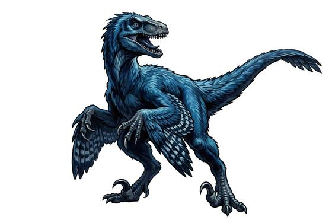

# Sickle-clawed raptor

{.illus}

*Set: Core*

*aka: ______________________________*

*[Reptilian](../Species_Families/reptilian.md) · medium biped · fast runner · prehistoric, fantasy, modern, sci-fi*

A man-sized feathered hunter, lean and quick, with a stiff tail for balance and a great curved killing claw on the second toe of each foot. It hunts in coordinated packs: one shows itself and feints, the others flank from the long grass, and then they leap together onto the prey, pinning it with claws and slashing.

It is frighteningly clever for a beast, testing fences, remembering places and learning from failed hunts. It fights while the pack fights. People who meet them learn to guard their flanks and watch the grass beside the one in front of them, since that is never the one that kills.

## Stat block

- **Attack** 19 · **Parry** — · **Dodge** 14 · **Armour** 1 · **Life** 16 · **Threat** 2
- **Attacks (2 a round):** sickle claws 1d6+1; bite 1d6+1
- **Attributes:** STR 12 DEX 17 AGI 17 END 12 INT 4 WIS 14 PER 14 CHA 3 COU 15
- **Skills:** [Stealth](../Skills/stealth.md) +5, [Hunting](../Skills/hunting.md) +5 (reroll 1), [Jumping](../Skills/jumping.md) +4
- **Powers:** —
- **Behaviour:** hunts in coordinated packs; one feints, others flank. **Morale:** fights while the pack fights.

How to read this block: [Bestiary](../bestiary.md).

## Not to be confused with

the *[giant raptor](giant-raptor.md)*, a larger, heavier sickle-clawed hunter; this one is man-sized and relies on pack tactics.

