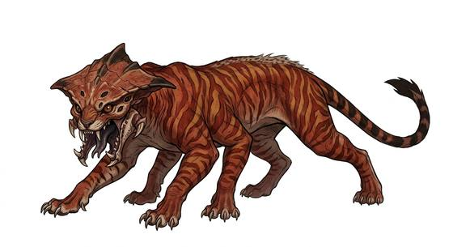

# Six-limbed apex cat

{.illus}

*Set: Expansion*

*aka: ______________________________*

*[Feline](../Species_Families/feline.md) · large quadruped · fast runner · sci-fi*

A black, sleek hunter with six legs, a heavy, armour-plated head and a long, whipping tail. It prowls the floor of a glowing jungle world, where plants light up at every touch and the air is thick with spores.

It stalks, then runs prey down in bursts of terrifying speed. Its senses are sharp enough to track by smell, sound and the faint heat of living bodies. It fights to the death. Even great beasts give it room, and hunters who want to cross its territory go with fire and in numbers. A cub raised by hand is said to be the most loyal companion a hunter could want.

## Stat block

- **Attack** 23 (rerolls 1) · **Parry** — · **Dodge** 11 · **Armour** 2 · **Life** 32 · **Threat** 3
- **Attacks (2 a round):** great bite 2d6; claws 1d6+2
- **Attributes:** STR 23 DEX 15 AGI 15 END 20 INT 5 WIS 13 PER 13 CHA 6 COU 17
- **Skills:** [Tracking](../Skills/tracking.md) +5 (reroll 1), [Stealth](../Skills/stealth.md) +5, [Running](../Skills/running.md) +5
- **Powers:** [Enhanced Senses](../Powers/enhanced-senses.md) 2
- **Behaviour:** stalks the jungle floor; runs prey down in bursts. **Morale:** fights to the death.

How to read this block: [Bestiary](../bestiary.md).

## Not to be confused with

the *[arena horned cat](arena-horned-cat.md)*, a four-eyed jungle cat; the apex cat is larger, six-legged and armour-headed.

