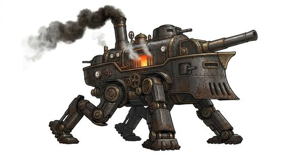

# Steam war walker

{.illus}

*Set: Core*

*aka: ______________________________*

*[Constructs and synthetics](../Species_Families/constructs-and-synthetics.md) · huge biped · slow · historical, fantasy, sci-fi*

A great iron war machine on two jointed legs, as tall as a house, with a glowing boiler in its belly and a crew or a clockwork brain in its head. Every stride shakes the street. Pipes along its arms vent jets of scalding steam across the battlefield.

It strides forward through barricades, stamping on cover and the soldiers behind it, and blasts steam into trenches and doorways. It is mindless and never flees. It is also slow and needs water and coal, and a burst boiler can blow it apart. Infantry who face it aim for the legs and the pipes, and try to lure it into mud where it will sink.

## Stat block

- **Attack** 22 · **Parry** — · **Dodge** 1 · **Armour** 6 · **Life** 54 · **Threat** 20++
- **Attacks (2 a round):** stomp 2d6
- **Attributes:** STR 28 DEX 6 AGI 6 END 26 INT 1 WIS 8 PER 8 CHA 1 COU 20
- **Skills:** [Lifting & Carrying](../Skills/lifting-and-carrying.md) +5 (reroll 1), [Intimidation](../Skills/intimidation.md) +4
- **Powers:** [Fire Blast](../Powers/fire-blast.md) 2, [Toughness](../Powers/toughness.md) 4
- **Behaviour:** strides forward venting scalding steam; crushes cover. **Morale:** mindless, never flees.

How to read this block: [Bestiary](../bestiary.md).

## Not to be confused with

The *[Diesel war crawler](diesel-war-crawler.md)*, a tracked machine that spits burning fuel; the steam war walker strides on legs and blasts steam.

