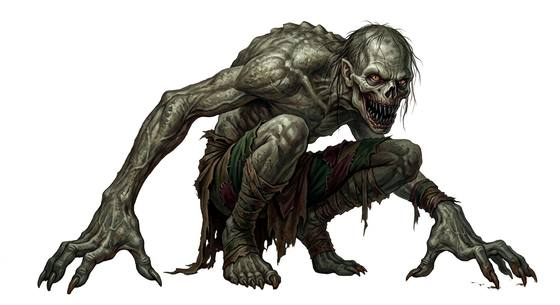

# Stench ghoul

{.illus}

*Set: Expansion*

*aka: ______________________________*

*[Undead and deathless](../Species_Families/undead-and-deathless.md) · medium biped · walk · sentient · fantasy, horror*

A bigger, older ghoul, grey-skinned and hunched, wrapped in a graveyard stink that turns stomachs and weakens knees. Its claws are long and filthy, and its teeth are sharp and yellow.

It leads ghoul packs, and its reek is so strong that the living retch and gag, making them easy prey. It is cunning and cruel, and it flees when badly hurt. Those who hunt it cover their faces with cloth soaked in vinegar or herbs, and try to kill it quickly before the stench overwhelms them.

## Stat block

- **Attack** 17 · **Parry** — · **Dodge** 11 · **Armour** 1 · **Life** 19 · **Threat** 2
- **Attacks (2 a round):** bite 1d6+1; claws 1d6+1
- **Attributes:** STR 13 DEX 14 AGI 14 END 13 INT 8 WIS 10 PER 10 CHA 4 COU 14
- **Skills:** [Stealth](../Skills/stealth.md) +4, [Tracking](../Skills/tracking.md) +4
- **Powers:** [Hold](../Powers/hold.md) 2, [Weaken](../Powers/weaken.md) 2
- **Behaviour:** leads ghoul packs; its reek makes the living retch. **Morale:** flees when badly hurt.
- **Kin:** subterranean corpse-eating ghoul

How to read this block: [Bestiary](../bestiary.md).

## Not to be confused with

the *[spore-ridden zombie](spore-ridden-zombie.md)*, a fungus-riddled corpse; the stench ghoul is a cunning pack leader whose reek sickens.

