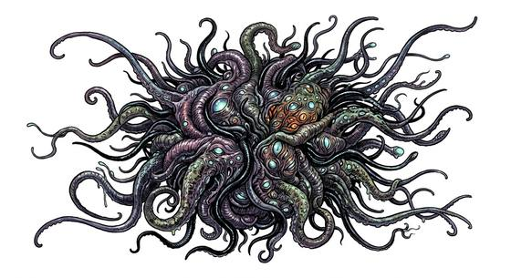

# Tentacled void horror

{.illus}

*Set: Core*

*aka: ______________________________*

*[Trans-dimensional](../Species_Families/trans-dimensional.md) · huge other · slow · horror, sci-fi, fantasy*

Where the world is thin, in a ruined temple, a laboratory's failed experiment or the site of a botched ritual, a crack opens in the air. Through it pushes a mass of grey-green tentacles, then eyes, then more tentacles, more than can possibly fit. The horror is only partly here. The rest of it is somewhere else, and far larger.

It moves slowly, dragging itself through the rift inch by inch, and anything its tentacles catch is pulled back through the crack and never seen again. It does not think in any human way and cannot be scared off. Fighting it means severing limbs until it withdraws. Ending it means closing the rift, which usually costs more than anyone wishes to pay.

## Stat block

- **Attack** 22 · **Parry** — · **Dodge** 3 · **Armour** 2 · **Life** 48 · **Threat** 5
- **Attacks (3 a round):** great bite 2d6+1; tentacle lash 2d6
- **Attributes:** STR 24 DEX 8 AGI 8 END 24 INT 6 WIS 12 PER 16 CHA 4 COU 20
- **Skills:** [Wrestling & Grappling](../Weapon_Groups/wrestling-and-grappling.md) +5 (reroll 1)
- **Powers:** [Madness](../Powers/madness.md) 3, [Portal](../Powers/portal.md) 2, [Toughness](../Powers/toughness.md) 3
- **Behaviour:** pushes through thin places; drags victims into the rift. **Morale:** mindless, never flees.

How to read this block: [Bestiary](../bestiary.md).

## Not to be confused with

The *[Rift tentacle mass](rift-tentacle-mass.md)*, a smaller thing that slips through tears between worlds; the void horror is vast and forces its way through thin places.

