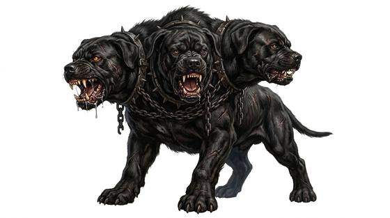

# Three-headed hound

{.illus}

*Set: Core*

*aka: ______________________________*

*[Canine](../Species_Families/canine.md) · large quadruped · fast runner · fantasy, myth, horror*

A huge black mastiff with three heads on three thick necks, each with its own snapping jaws, its own yellow eyes and its own temper. The heads keep separate watches, and one is always awake. It is set to guard a gate, usually the gate between the living world and whatever lies beyond it, and it has a rule: the living may pass in, but nothing passes out.

It sees in darkness, it never tires and its hide shrugs off blows that would kill an ox. It fights to the death. Heroes of old tales got past it with music, with honey cakes laced with sleep, or with sheer strength, dragging it into the daylight. Those who try force alone are rarely heard from again.

## Stat block

- **Attack** 21 · **Parry** — · **Dodge** 8 · **Armour** 2 · **Life** 34 · **Threat** 3
- **Attacks (3 a round):** bite 1d6+2
- **Attributes:** STR 20 DEX 12 AGI 12 END 18 INT 4 WIS 12 PER 17 CHA 5 COU 18
- **Skills:** (reroll 1), [Tracking](../Skills/tracking.md) +5, [Intimidation](../Skills/intimidation.md) +5
- **Powers:** [Toughness](../Powers/toughness.md) 2, [Night & Spectrum Sight](../Powers/night-and-spectrum-sight.md) 2
- **Behaviour:** guards a gate; lets the living pass in, never out. **Morale:** fights to the death.

How to read this block: [Bestiary](../bestiary.md).

## Not to be confused with

the *[black dog](black-dog.md)*, a single-headed spectral hound that haunts roads and churchyards; the three-headed hound guards one gate and never leaves it.

