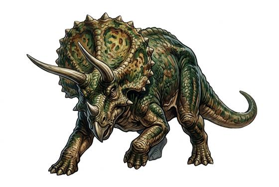

# Three-horned beast

{.illus}

*Set: Expansion*

*aka: ______________________________*

*[Reptilian](../Species_Families/reptilian.md) · huge quadruped · walk · prehistoric, fantasy*

A bull-like plant-eater as big as an elephant, with a bony frill that shields its neck and three long horns, two over the eyes and one on the nose. It lives in herds on open plains and forest edges, grazing low plants, and it does not run from danger.

It lowers its frill and charges anything that threatens it or its young. The horns can impale a tyrant, and the frill turns most bites. It fights while it can. Explorers treat it as a living fortress, and those who hunt it bring many spears and a way to get out quickly.

## Stat block

- **Attack** 20 · **Parry** — · **Dodge** 2 · **Armour** 2 · **Life** 42 · **Threat** 5
- **Attacks (2 a round):** horns 2d6+1
- **Attributes:** STR 26 DEX 7 AGI 7 END 22 INT 2 WIS 10 PER 13 CHA 3 COU 16
- **Skills:** [Intimidation](../Skills/intimidation.md) +5
- **Powers:** [Toughness](../Powers/toughness.md) 2
- **Behaviour:** lowers its frill and charges anything that threatens. **Morale:** fights while it can.

How to read this block: [Bestiary](../bestiary.md).

## Not to be confused with

the *[small horned dinosaur](small-horned-dinosaur.md)*, a sheep-sized beaked plant-eater; the three-horned beast is enormous and charges anything.

