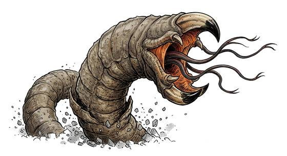

# Tremor-hunting worm

{.illus}

*Set: Expansion*

*aka: ______________________________*

*[Serpentine](../Species_Families/serpentine.md) · huge serpentine · burrower · horror, modern*

A blind grey worm as thick as a wagon, living just under the desert or prairie floor. It hears every footfall, every hoof and every dropped stone through the earth, and it rises beneath the sound with a wide, beaked mouth. From that mouth come several long, snake-like tongues that seize prey and drag it down.

It cannot see, smell or hear the air. The rule of survival in its country is simple: stay off the ground. People climb rocks, roofs and stilts, and cross open ground in silence, one careful step at a time. It never gives up while it still hears movement.

## Stat block

- **Attack** 21 · **Parry** — · **Dodge** 3 · **Armour** 2 · **Life** 46 · **Threat** 4
- **Attacks (2 a round):** great bite 2d6+1; tongue 1d6+2
- **Attributes:** STR 24 DEX 8 AGI 8 END 22 INT 1 WIS 10 PER 10 CHA 1 COU 20
- **Skills:** [Tracking](../Skills/tracking.md) +5 (reroll 1), [Stealth](../Skills/stealth.md) +4
- **Powers:** [Burrowing](../Powers/burrowing.md) 4, [Radar Sense](../Powers/radar-sense.md) 3, [Toughness](../Powers/toughness.md) 3
- **Behaviour:** hunts by vibration; stay off the ground and it cannot find you. **Morale:** mindless, never flees.

How to read this block: [Bestiary](../bestiary.md).

## Not to be confused with

*[Giant burrowing worm](giant-burrowing-worm.md)*, a digging worm that simply swallows what it finds, where the tremor-hunting worm hunts by vibration and seizes prey with tongues.

