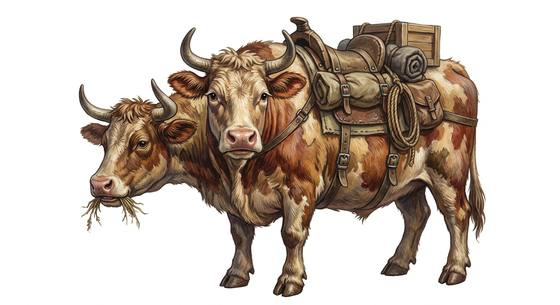

# Two-headed wasteland cow

{.illus}

*Set: Expansion*

*aka: ______________________________*

*[Ungulate](../Species_Families/ungulate.md) · large quadruped · walk · post-apocalyptic*

A big, shaggy, two-headed cow, born of the poisoned lands and bred ever since by wasteland folk. Each head has its own mind, of a sort, and they sometimes argue about which way to go. The beast is hardy, dim and gentle, able to live on scrub and bad water, and it carries loads that would break a mule.

Caravans rely on it, and farmers keep it for milk, meat and hides. It is a herd animal and placid most of the time, but when frightened it stampedes, and a stampede of these is a thing to get out of the way of. Traders measure wealth in head of cattle, and joke about counting heads twice.

## Stat block

- **Attack** 11 · **Parry** — · **Dodge** 3 · **Armour** 1 · **Life** 23 · **Threat** 1
- **Attacks (2 a round):** horns 2d6
- **Attributes:** STR 18 DEX 7 AGI 7 END 22 INT 2 WIS 8 PER 8 CHA 4 COU 7
- **Skills:** (reroll 1), [Survival: Ruins & Wasteland](../Skills/survival-ruins-and-wasteland.md) +4
- **Powers:** —
- **Behaviour:** herd beast; placid pack animal; stampedes if frightened. **Morale:** flees at first wound.

How to read this block: [Bestiary](../bestiary.md).

## Not to be confused with

*[Draft ox](draft-ox.md)*, an ordinary beast of burden with one head, where the wasteland cow is a hardy, two-headed mutant.

