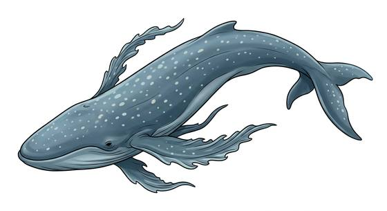

# Vacuum plankton whale

{.illus}

*Set: Expansion*

*aka: ______________________________*

*[Aquatic](../Species_Families/aquatic.md) · gigantic flyer · flyer · sci-fi*

A dumb, gentle giant that swims through open space, feeding on nebular gas. It is vast and slow, with a long, streamlined body, wide, rippling fins and a mouth that filters gas like the baleen of a sea whale.

Herds graze on gas clouds and, when the grazing is done, jump between stars together in a single leap. They flee when badly hurt. Space travellers regard them with awe, and some follow them to find new stars. Hunting them is forbidden in most civilised places, but poachers still try, because their hides are said to be vacuum-proof.

## Stat block

- **Attack** 16 · **Parry** — · **Dodge** -3 · **Armour** 2 · **Life** 58 · **Threat** 6
- **Attacks (3 a round):** tail 2d6+1
- **Attributes:** STR 30 DEX 4 AGI 4 END 35 INT 4 WIS 10 PER 13 CHA 8 COU 12
- **Skills:** (reroll 3)
- **Powers:** [Environmental Immunity](../Powers/environmental-immunity.md) 5, [Flight](../Powers/flight.md) 3, [Long Teleport](../Powers/long-teleport.md) 3
- **Behaviour:** herds graze on gas clouds; jump between stars together. **Morale:** flees when badly hurt.

How to read this block: [Bestiary](../bestiary.md).

## Not to be confused with

the *[floating sky whale](floating-sky-whale.md)*, which drifts through a planet's air; the plankton whale swims through space.

