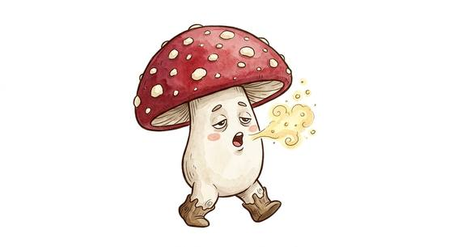

# Walking toadstool

{.illus}

*Set: Expansion*

*aka: ______________________________*

*[Fungal](../Species_Families/fungal.md) · small biped · walk · fantasy*

A knee-high mushroom with a broad, spotted cap and a thick pale stem that splits into stubby root-feet. Walking toadstools shuffle about in slow circles, often in rings of a dozen or more, and at dusk they puff out soft clouds of spores that make anyone nearby sleepy and slow. They are harmless on their own. The danger is falling asleep in a dark wood.

Country folk say the rings mark places where the little people dance, and step around them. Children who wander into one come home yawning and late with a strange story. Herb-sellers gather the caps, very carefully, for sleeping draughts.

## Stat block

- **Attack** 12 · **Parry** — · **Dodge** 6 · **Armour** 1 · **Life** 8 · **Threat** minor+
- **Attacks:** slam 1d4
- **Attributes:** STR 6 DEX 8 AGI 8 END 8 INT 1 WIS 6 PER 6 CHA 1 COU 20
- **Skills:** [Stealth](../Skills/stealth.md) +3, [Survival: Caves & Underground](../Skills/survival-caves-and-underground.md) +5
- **Powers:** [Sleep](../Powers/sleep.md) 2
- **Behaviour:** wanders in rings; puffs sleep spores. **Morale:** mindless, never flees.

How to read this block: [Bestiary](../bestiary.md).

## Not to be confused with

*[Sleep-pollen flower](sleep-pollen-flower.md)*, a rooted bloom that lulls victims and then feeds on them, where the toadstool wanders and merely makes people drowsy.

