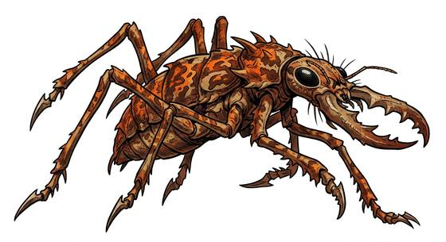

# Warrior hive bug

{.illus}

*Set: Expansion*

*aka: ______________________________*

*[Insectoid and arachnid](../Species_Families/insectoid-and-arachnid.md) · large many-legged · fast runner · sci-fi*

The soldier caste of a desert hive world: a bug as big as a horse, with a hard, sand-coloured shell, snapping mandibles and four long legs that end in spear points. It moves in jerky, scuttling bursts and is far faster than anything that shape has a right to be.

They come in waves, endless and indifferent to loss, and they swamp defensive lines by sheer weight of bodies. A bug with its legs shot away will still crawl forward and bite. It never flees, and wounds that would drop any other beast barely slow it; only a hit to the nerve cluster in its body stops it cold. Soldiers who fight them learn where to aim, and to keep their backs to each other.

## Stat block

- **Attack** 21 · **Parry** — · **Dodge** 9 · **Armour** 2 · **Life** 27 · **Threat** 3
- **Attacks (2 a round):** blade arms 1d6+2; mandibles 1d6+2
- **Attributes:** STR 18 DEX 13 AGI 13 END 17 INT 2 WIS 8 PER 10 CHA 1 COU 20
- **Skills:** [Running](../Skills/running.md) +5, [Climbing](../Skills/climbing.md) +4
- **Powers:** [Hive Mind](../Powers/hive-mind.md) 2
- **Behaviour:** charges in endless waves; stabs with spear-legs. **Morale:** mindless, never flees.

How to read this block: [Bestiary](../bestiary.md).

## Not to be confused with

the *[hive pack runner](hive-pack-runner.md)*, a smaller, dog-sized swarm beast; the warrior bug is a large, spear-legged soldier caste.

