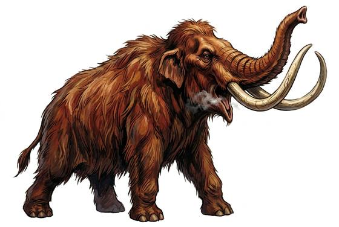

# Woolly mammoth

{.illus}

*Set: Core*

*aka: ______________________________*

*[Pachyderm](../Species_Families/pachyderm.md) · huge quadruped · walk · prehistoric, fantasy, historical*

A shaggy elephant of the frozen steppe, covered in long red-brown hair over a thick undercoat, with small ears, a humped back and great curling tusks longer than a man. It moves in family herds led by old females, sweeping snow aside with tusks and trunk to reach the grass beneath.

Herds guard their calves with fierce care. When threatened, the adults form a wall and charge with tusks lowered, and anything caught under them is stamped flat. They flee when badly hurt. Stone-age peoples live on them: meat for the winter, hides for tents, bones and tusks for huts and tools. A mammoth hunt is the work of a whole band, and some hunters never come home.

## Stat block

- **Attack** 18 · **Parry** — · **Dodge** 2 · **Armour** 2 · **Life** 40 · **Threat** 3
- **Attacks (2 a round):** tusks 2d6+1; stomp 2d6
- **Attributes:** STR 27 DEX 7 AGI 7 END 22 INT 4 WIS 12 PER 15 CHA 5 COU 13
- **Skills:** [Survival: Arctic](../Skills/survival-arctic.md) +5 (reroll 1)
- **Powers:** [Toughness](../Powers/toughness.md) 2
- **Behaviour:** herds guard calves; charges threats with tusks. **Morale:** flees when badly hurt.

How to read this block: [Bestiary](../bestiary.md).

## Not to be confused with

the *[mastodon](mastodon.md)*, a stocky forest cousin with straight tusks; the mammoth is taller, shaggier and lives on the open steppe.

