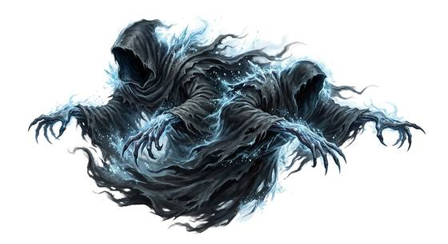

# Wraith

{.illus}

*Set: Expansion*

*aka: ______________________________*

*[Energy and incorporeal](../Species_Families/energy-and-incorporeal.md) · medium other · hover · sentient · fantasy, horror*

A dark, ghostly shape, all tattered hood and long, clawed hands, drifting silently through walls and floors. Its face is hidden, or perhaps it has none, and the air around it is cold and stale.

It feeds on sleepers, draining the life out of them with its touch, and they wake weak, pale and cold, if they wake at all. It flees from sunlight and hides in the dark by day. Priests and ghost hunters use holy symbols, silver and light to drive it off.

## Stat block

- **Attack** 16 · **Parry** — · **Dodge** 11 · **Armour** 0 · **Life** 18 · **Threat** minor+
- **Attacks:** claws 1d6
- **Attributes:** STR 4 DEX 14 AGI 14 END 12 INT 10 WIS 12 PER 16 CHA 6 COU 18
- **Skills:** [Stealth](../Skills/stealth.md) +5 (reroll 1)
- **Powers:** [Etherealness](../Powers/etherealness.md) 3, [Life Drain](../Powers/life-drain.md) 3, [Darkness](../Powers/darkness.md) 2
- **Behaviour:** drifts through walls; feeds on sleepers. **Morale:** flees from sunlight.

How to read this block: [Bestiary](../bestiary.md).

## Not to be confused with

the *[spectre](spectre.md)*, a pale ghost shaped like its former self; the wraith is a hooded shape that drains life from sleepers.

