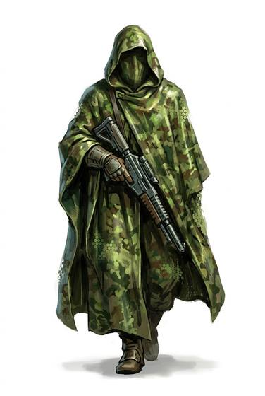

# Adaptive camouflage cloak

{.illus}

*Set: Expansion*

*aka: ______________________________*

*Clothing · Needs: far future · far future*

A hooded cloak whose outer surface is covered in tiny cells that capture the light behind the wearer and show it on the front. In any landscape the wearer becomes a slight ripple in the air, like heat shimmer. Moving slowly, they are almost invisible. Running breaks the illusion, as the cells lag behind the movement and the wearer's outline shows in patches.

## Game block

- **Slot:** outer
- **Bonus:** +3 Stealth when moving slowly; +2 Camouflage any terrain
- **Penalty:** −1 Stealth when running
- **Used for:** —
- **Weight:** 1 kg · **Needs:** far future · **Price:** 40 S
- **Also known as:** chameleon cloak, active camo cloth

## Not to be confused with

*[Adaptive camouflage suit](adaptive-camouflage-suit.md)*, a close-fitting version that works best standing still and covers the wearer more completely.

