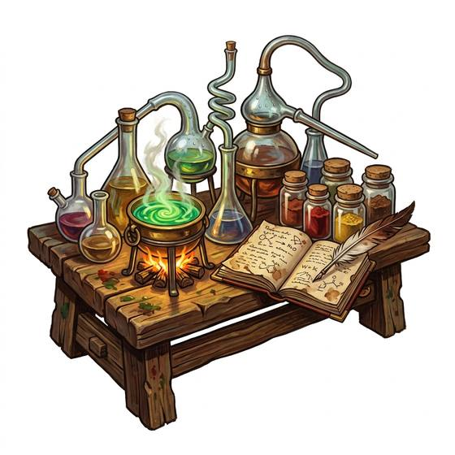

# Alchemist's kit

{.illus}

*Set: Expansion*

*aka: ______________________________*

*Tools and trade kits · Needs: writing · any*

A padded chest of glass retorts, copper alembics, clay crucibles, mortars and a rank of stoppered jars. With them the alchemist distils, dissolves, purifies and combines, chasing the hidden nature of things. Some of the results are medicines, some are dyes and some explode. The workroom smells of sulphur and smoke, and the neighbours often complain.

## Game block

- **Bonus:** 0
- **Penalty:** 0
- **Used for:** [Alchemy](../Skills/alchemy.md), [Remedies & Pharmacy](../Skills/remedies-and-pharmacy.md)
- **Weight:** 10 kg · **Needs:** writing · **Price:** 25 S
- **Also known as:** alembic set

## Not to be confused with

the *[Chemistry Kit](chemistry-kit.md)*, which does similar work by tested method rather than old lore.

