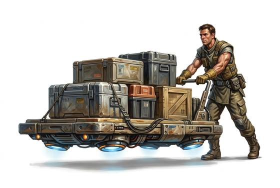

# Anti-grav sled

{.illus}

*Set: Expansion*

*aka: ______________________________*

*Fields and far-future devices · Needs: far future · far future*

A flat pallet that floats at knee height and can carry a great deal of cargo, pushed along by hand. It glides over floors, fields and ramps, but struggles on steep slopes. Warehouse crews, quartermasters and haulers depend on it. When its charge fails, the pallet drops heavily to the ground, often on someone's foot.

## Game block

- **Bonus:** +2 Cargo Handling moving heavy loads; +1 Logistics hauling supplies
- **Penalty:** 0
- **Used for:** [Cargo Handling](../Skills/cargo-handling.md)
- **Weight:** 30 kg · **Needs:** far future · **Price:** 60 S
- **Also known as:** hover sled, float pallet

## Not to be confused with

the *[Gravity Lifter](gravity-lifter.md)*, which lightens a single load in the hand rather than carrying cargo on a pallet.

