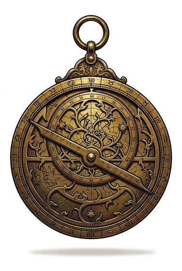

# Astrolabe

{.illus}

*Set: Expansion*

*aka: ______________________________*

*Navigation and timekeeping · Needs: iron · desert peoples*

A flat brass disc engraved with scales and stars, with a pierced star plate turning over the face and a sighting rule across the back. Desert astronomers made them beautiful, with lacy brass and inlaid names, because they were instruments of learning as much as of travel. Held up by its ring, it measures the height of the sun or a star. With it a scholar can tell the hour, find the direction of prayer or fix how far north a ship has sailed.

## Game block

- **Bonus:** +1 Astronomy & Calendars any; +1 Sea Navigation finding latitude
- **Penalty:** 0
- **Used for:** [Astronomy & Calendars](../Skills/astronomy-and-calendars.md), [Sea Navigation](../Skills/sea-navigation.md)
- **Weight:** 1.5 kg · **Needs:** iron · **Price:** 10 S
- **Also known as:** star taker

## Not to be confused with

the *[Cross Staff](cross-staff.md)*, a plain rod that measures a star's height but can't tell time or map the heavens.

