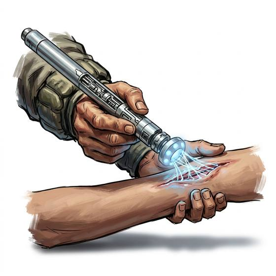

# Auto-doc wand

{.illus}

*Set: Expansion*

*aka: ______________________________*

*Medicine and healing · Needs: far future · far future*

A smooth handheld wand that hums as it is passed slowly over a patient. It scans the body, names the illness or injury in a calm voice, and closes small wounds with thin beams of warm light. Ship's medics and far-future healers rely on it as their predecessors relied on the stethoscope. It knows only the diseases in its memory; a new plague on an alien world can leave it baffled.

## Game block

- **Bonus:** +2 Medicine diagnosis and treatment; +1 First Aid closing wounds
- **Penalty:** 0
- **Used for:** [Medicine](../Skills/medicine.md), [First Aid](../Skills/first-aid.md)
- **Weight:** 0.5 kg · **Needs:** far future · **Price:** 80 S
- **Also known as:** healing wand, diagnostic wand

## Not to be confused with

*[Medical Scanner](medical-scanner.md)*, which diagnoses but cannot treat; the wand both reads the patient and mends small injuries.

