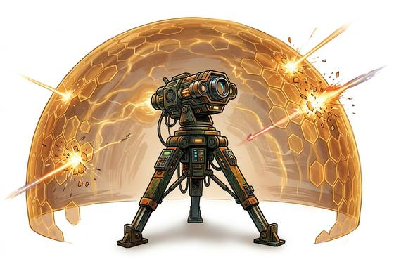

# Barrier projector

{.illus}

*Set: Expansion*

*aka: ______________________________*

*Fields and far-future devices · Needs: far future · far future*

A folding tripod with a glowing emitter on top that throws up a shimmering wall of force the size of a door. Shots strike it and splash harmlessly away, making it perfect cover in a firefight. Soldiers and security teams set it up in seconds. Its shimmer is visible from far off, though, and the enemy always knows exactly where their target is hiding.

## Game block

- **Bonus:** +2 Dodge behind the barrier against shots
- **Penalty:** −1 Stealth its shimmer is visible
- **Used for:** —
- **Weight:** 6 kg · **Needs:** far future · **Price:** 60 S
- **Also known as:** cover field

## Not to be confused with

the *[Heavy Barrier Emitter](heavy-barrier-emitter.md)*, a larger and stronger version for holding a defensive position.

