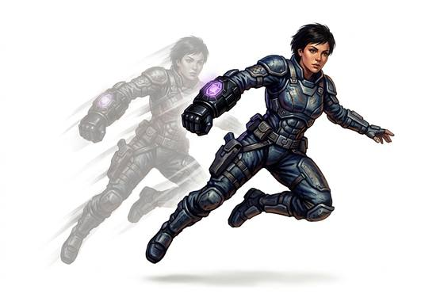

# Blink device

{.illus}

*Set: Expansion*

*aka: ______________________________*

*Fields and far-future devices · Needs: far future · far future*

A slim device worn on the wrist that jumps its wearer a few paces in the blink of an eye, out of the path of danger. It is useful once in a tight spot, and then it must rest. Soldiers and adventurers carry them for emergencies. Each jump leaves its user dizzy and unsteady for a moment.

## Game block

- **Bonus:** +2 Dodge blinking out of danger once per scene
- **Penalty:** −1 END disorientation after each jump
- **Used for:** —
- **Weight:** 0.5 kg · **Needs:** far future · **Price:** 60 S
- **Also known as:** short-hop teleporter

## Not to be confused with

the *[Teleport Beacon](teleport-beacon.md)*, which pulls its carrier all the way home rather than a few steps away.

