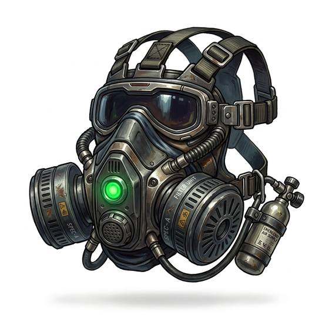

# Breather mask

{.illus}

*Set: Expansion*

*aka: ______________________________*

*Environment and survival gear · Needs: spaceflight · space-faring*

A light, close-fitting mask that covers nose and mouth, with small filters at the cheeks. It takes air that would slowly poison or starve a traveller, strains out what is harmful, adds what is missing and passes on something breathable for hours at a time. Colonists on half-friendly worlds wear them the way others wear hats. It muffles the voice, and conversations among a masked crew can be slow and repetitive.

## Game block

- **Slot:** face
- **Bonus:** +2 END in thin or tainted air
- **Penalty:** −1 CHA speaking through it
- **Used for:** —
- **Weight:** 0.5 kg · **Needs:** spaceflight · **Price:** 10 S
- **Also known as:** alien-air mask

## Not to be confused with

the *[Environment Suit](environment-suit.md)*, which seals the whole body against hostile air; the breather mask only helps the lungs.

