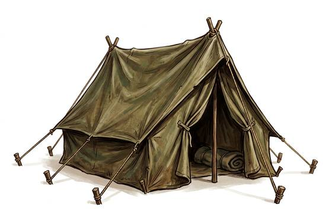

# Canvas tent

{.illus}

*Set: Expansion*

*aka: ______________________________*

*Camp and shelter · Needs: iron · any*

A ridge tent of oiled or waxed cloth on two poles and a ridge pole, or a round bell of canvas on a single central pole, pegged down with ropes. It is the tent of armies, surveyors and pilgrims for centuries. It keeps rain off, though touching the inside when wet lets the water through. Pitching it in a hurry, at night, in a gale, is one of the great shared miseries of travel.

## Game block

- **Bonus:** +1 END against rain
- **Penalty:** 0
- **Used for:** —
- **Weight:** 12 kg · **Needs:** iron · **Price:** 20 S
- **Also known as:** wedge tent, bell tent

## Not to be confused with

*[Pavilion](pavilion.md)*, the same idea on a grand scale, made to impress rather than simply to shelter.

