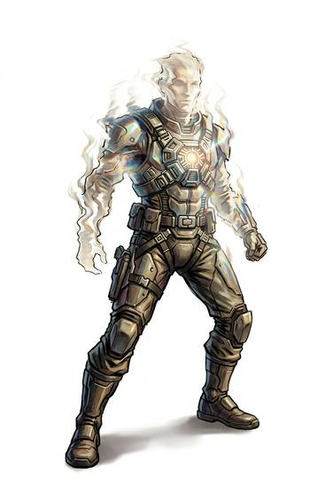

# Cloaking field emitter

{.illus}

*Set: Expansion*

*aka: ______________________________*

*Fields and far-future devices · Needs: far future · far future*

A harness with a small emitter on the chest that bends light around its wearer, so they all but vanish from sight. Standing still, they are almost invisible; moving, they are a faint ripple in the air. Spies and assassins prize it. Rain, dust and smoke outline the field clearly, and a cloaked figure caught in the weather is suddenly a ghost in plain view.

## Game block

- **Bonus:** +3 Stealth standing still; +2 Stealth moving
- **Penalty:** −2 Stealth in rain, dust or smoke
- **Used for:** —
- **Weight:** 1 kg · **Needs:** far future · **Price:** 50 S
- **Also known as:** cloak emitter

## Not to be confused with

the *[Holographic Disguise](holographic-disguise.md)*, which changes how the wearer looks rather than hiding them entirely.

