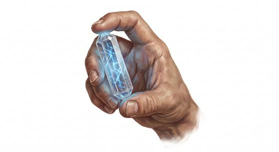

# Data crystal

{.illus}

*Set: Expansion*

*aka: ______________________________*

*Writing and records · Needs: far future · far future*

A clear crystal no larger than a fingertip, its lattice laced with patterns of light that store vast libraries of text, image and sound. Held up to the right reader, it opens like a window onto every book of a lost civilisation. Scholars, archivists and treasure hunters seek such crystals in ruins and wrecks. They last almost forever, but a crack through the heart can erase them.

## Game block

- **Bonus:** +2 Research holding a whole library
- **Penalty:** 0
- **Used for:** [Research](../Skills/research.md), [Computer Use](../Skills/computer-use.md)
- **Weight:** — · **Needs:** far future · **Price:** 10 S
- **Also known as:** memory crystal

## Not to be confused with

*[Memory Stick](memory-stick.md)*, which holds a modern amount of files; the data crystal holds entire libraries.

