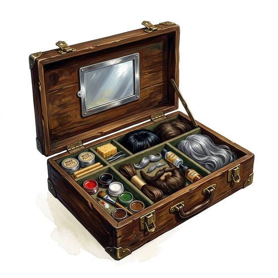

# Disguise kit

{.illus}

*Set: Expansion*

*aka: ______________________________*

*Tools and trade kits · Needs: writing · any*

A box of paints, powders, putty, wigs, false beards and a few simple changes of clothing. With practice, the user changes their age, their station and even their apparent people. Actors, spies and con artists all rely on one. A good disguise is mostly in the posture and the voice, and the kit only helps the lie along.

## Game block

- **Bonus:** 0
- **Penalty:** 0
- **Used for:** [Disguise](../Skills/disguise.md), [Acting](../Skills/acting.md)
- **Weight:** 2 kg · **Needs:** writing · **Price:** 10 S
- **Also known as:** makeup kit

## Not to be confused with

the *[Forger's Kit](forger-s-kit.md)*, which fakes documents rather than faces.

