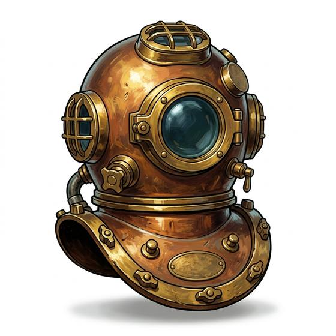

# Diving helmet

{.illus}

*Set: Expansion*

*aka: ______________________________*

*Environment and survival gear · Needs: steam · industrial cities*

A heavy copper helmet with round glass portholes, bolted to a canvas suit and fed with air pumped down a hose from the surface. Weighted boots keep the diver on the bottom, where they can work for hours on wrecks, hulls and harbour walls. It is an armour of sorts against the sea, and just as clumsy. The diver cannot swim, only walk, and depends utterly on whoever is working the pump above.

## Game block

- **Slot:** full body
- **Bonus:** +2 Diving long work on the seabed
- **Penalty:** −2 DEX heavy suit; −2 Swimming can only walk the bottom
- **Used for:** [Diving](../Skills/diving.md)
- **Weight:** 80 kg · **Needs:** steam · **Price:** 40 S
- **Also known as:** standard diving dress, hard-hat dress

## Not to be confused with

the *[Scuba Set](scuba-set.md)*, which lets a diver swim freely with their own air instead of walking the bottom on a hose.

