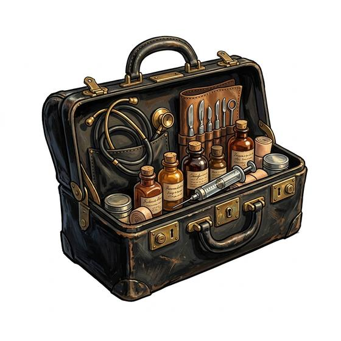

# Doctor's bag

{.illus}

*Set: Core*

*aka: ______________________________*

*Medicine and healing · Needs: steam · industrial cities*

A hinged leather bag that snaps open wide at the top, packed with a stethoscope, a thermometer, a syringe, dressings, small bottles of common drugs and a prescription pad. It is the country doctor's whole practice, carried in a buggy or by bicycle to farms and cottages at all hours. The sight of it at the door is a relief to some families and a terror to others.

## Game block

- **Bonus:** +1 Medicine on house calls
- **Penalty:** 0
- **Used for:** [Medicine](../Skills/medicine.md), [First Aid](../Skills/first-aid.md)
- **Weight:** 4 kg · **Needs:** steam · **Price:** 40 S
- **Also known as:** physician's bag

## Not to be confused with

*[Midwife's Kit](midwife-s-kit.md)*, which is packed for childbirth; the doctor's bag holds general supplies for house calls.

