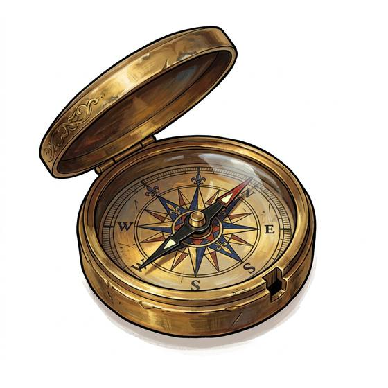

# Dry compass

{.illus}

*Set: Core*

*aka: ______________________________*

*Navigation and timekeeping · Needs: printing · any*

A needle or a painted card balanced on a pin inside a small box under glass, with a rose of directions marked around the rim. It needs no water and holds its heading on a moving deck or a jolting saddle. Every traveller who can afford one carries it, usually in an inside pocket. Old seafarers still tap the glass before trusting it, and keep their knives well away from the box.

## Game block

- **Bonus:** +1 Wayfinding any
- **Penalty:** 0
- **Used for:** [Wayfinding](../Skills/wayfinding.md), [Sea Navigation](../Skills/sea-navigation.md)
- **Weight:** 0.2 kg · **Needs:** printing · **Price:** 3 S
- **Also known as:** pocket compass, mariner's compass

## Not to be confused with

the *[Sighting Compass](sighting-compass.md)*, which adds a sight and a mirror to take exact bearings on distant landmarks.

