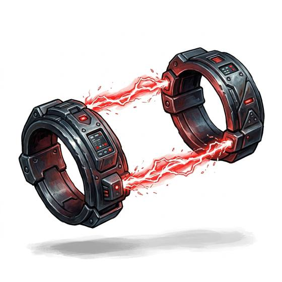

# Energy restraints

{.illus}

*Set: Expansion*

*aka: ______________________________*

*Security and thievery · Needs: far future · far future*

A pair of slim bands that snap around the wrists and lock together with an invisible field, holding the arms fast with no chain in sight. Struggle, and the bands deliver a sharp, stinging shock; keep struggling, and the shocks get worse. Station security and far-future lawmen favour them because they cannot be picked with a hairpin or cut with a file. Escaping them is a far harder business than slipping any iron cuff.

## Game block

- **Bonus:** 0
- **Penalty:** 0
- **Used for:** —
- **Weight:** 0.2 kg · **Needs:** far future · **Price:** 20 S
- **Also known as:** field cuffs

## Not to be confused with

*[Handcuffs](handcuffs.md)*, mechanical steel cuffs that a skilled prisoner can pick, slip or saw through.

