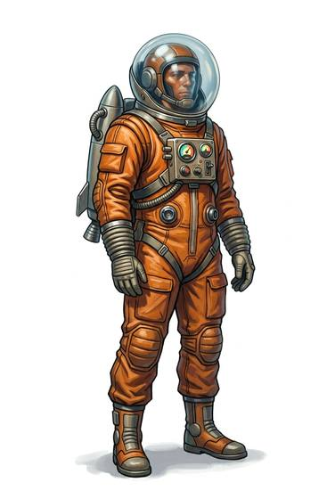

# Environment suit

{.illus}

*Set: Expansion*

*aka: ______________________________*

*Environment and survival gear · Needs: spaceflight · space-faring*

A light sealed suit of flexible fabric with a clear helmet and a small air pack on the back. It keeps out poisonous air, scorching heat and bitter cold while leaving the wearer free to walk, climb and work for hours. Colonists and explorers of harsh worlds wear them as everyday clothing. It is not built for true vacuum, which is a lesson some learn the hard way.

## Game block

- **Slot:** full body
- **Bonus:** +2 END against toxic air, heat and cold
- **Penalty:** −1 DEX gloved hands
- **Used for:** [Environment Suits](../Skills/environment-suits.md)
- **Weight:** 5 kg · **Needs:** spaceflight · **Price:** 40 S
- **Also known as:** soft environment suit

## Not to be confused with

the *[Pressure Suit](pressure-suit.md)*, which is stiffer but keeps a pilot alive in the near-vacuum of the upper sky.

