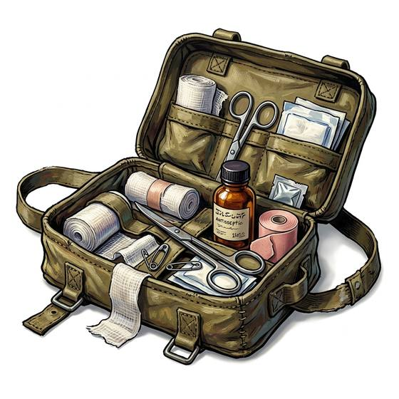

# First aid kit

{.illus}

*Set: Core*

*aka: ______________________________*

*Medicine and healing · Needs: electricity · modern*

A small hard case, usually marked with a bright symbol, holding plasters, dressings, a roll of bandage, antiseptic wipes, small scissors, tweezers and a strip of painkillers. It lives in kitchens, cars, offices and backpacks, and most of its contents are used on grazes and burnt fingers. It is not for great wounds; it is for the everyday cuts and sprains that nobody should ignore.

## Game block

- **Bonus:** +1 First Aid cuts, burns and sprains
- **Penalty:** 0
- **Used for:** [First Aid](../Skills/first-aid.md)
- **Weight:** 0.8 kg · **Needs:** electricity · **Price:** 1 S
- **Also known as:** aid box, first aid pouch

## Not to be confused with

*[Trauma Kit](trauma-kit.md)*, which is packed for gunshot and blast wounds; the first aid kit handles everyday cuts and burns.

