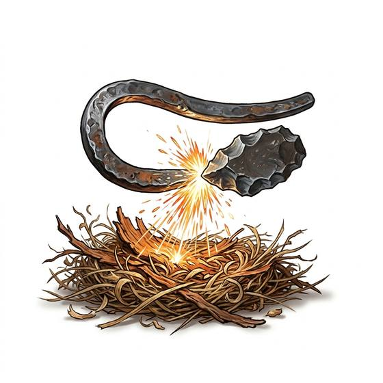

# Flint and steel

{.illus}

*Set: Core*

*aka: ______________________________*

*Light and fire · Needs: iron · any*

A curved striker of hard steel and a sharp flint, struck together to shower hot sparks onto char cloth or dry tinder. It was the everyday way to make fire for centuries, cheap and reliable, and a good one lasts a lifetime. The trick is in the angle of the blow and the quality of the tinder.

## Game block

- **Bonus:** 0
- **Penalty:** 0
- **Used for:** [Fire-Making](../Skills/fire-making.md)
- **Weight:** 0.1 kg · **Needs:** iron · **Price:** 5 C
- **Also known as:** fire steel, striker

## Not to be confused with

*[Tinderbox](tinderbox.md)*, which keeps flint, steel and char cloth together in one ready tin.

